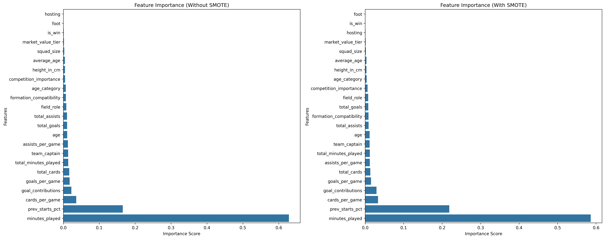

# Soccer Starting XI
Leveraging AWS tools and machine learning models, this project investigates soccer match data to predict whether a soccer player will be in the starting lineup for an upcoming game.

## Data:
[Soccer Matches Data](https://www.kaggle.com/datasets/davidcariboo/player-scores) gathered from Kaggle.

## Models:
-	Random Forest

## Key Insights:
-	**Influential Factors:** The most significant factors determining a player's starting status are their minutes played, percentage of starting lineup appearances in previous games, and cards played per game. 

  

## Key Technologies:
**Language:** Python

**Libraries:**
- boto3 (AWS SDK for Python)
- pyarrow (In-Memory Data Processing)
- imblearn (Class Balancing)
- sklearn (Modeling and Evaluating)
- matplotlib (Data Visualizations)
- seaborn (Data Visualizations)

**Other Tools:**
- PySpark
- AWS S3
- AWS Athena
- AWS EMR

## Full Project Write-up:
For a detailed narrative, comprehensive methodology, and deeper insights into this project, please read the full write-up on [LinkedIn](https://www.linkedin.com/in/gaelmotahernandez/details/projects/1733244193743/single-media-viewer/?profileId=ACoAAD0sr1oBRU-g7rHenPy0sFhxgU6vSvExSdU).

---
